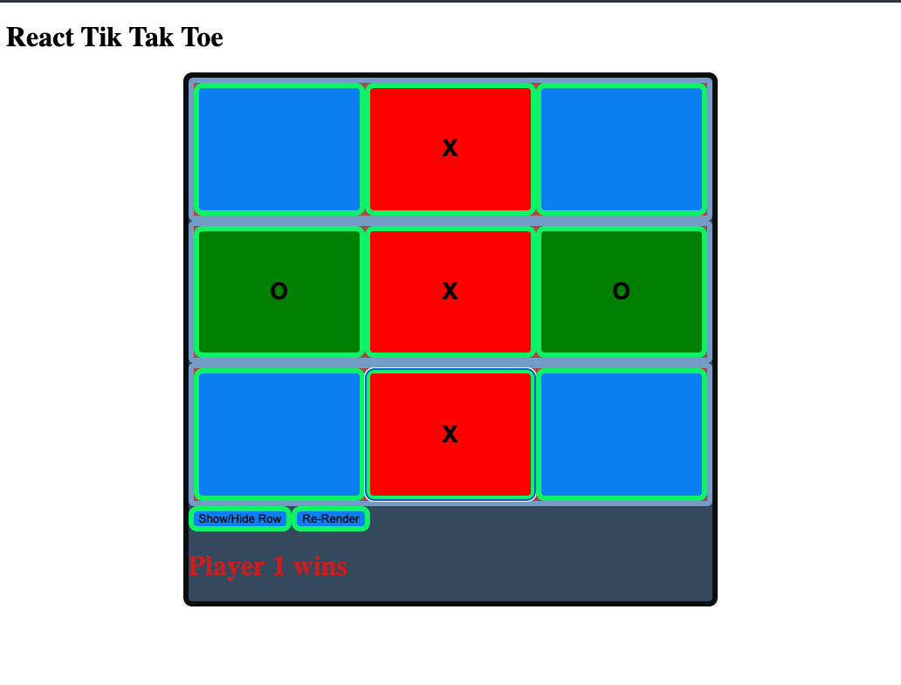

# React-Tik-Tak-Toe

React-Tik-Tak-Toe exercise was created for MITxPro full-stack web development program.  

<a href="https://foreverphoenix21.github.io/Real-Time-Bus-Tracking/">
   </a
>

## Description:

 React-Tik-Tak-Toe is a project built to demonstrate the use of hooks, useState, and the relationship between parent and child components. 

## Installation:

 Upload the HTML file to your browser or fork and clone the project saving the files to your local hard drive. 
 

You can also run the program by clicking on the above picture in this readme file.

## Usage:

 Have fun playing the classic game of Tik Tak Toe or dive into the code and see how the code updates the useState in React to render information such as the block color, player logic, and game logic.

## Roadmap:

*
 This exercise will continually be built and improved on as I learn additional skills in Javascript. 
*

***

**
 Future updates: 
**
- Create a function that keeps players total wins 
- Create a button to switch players
- Create a function that allows the user to choose their player color or picture.  
- Create a line that crosses out the winning row/colomn when a player wins.  
- creat a splash screen for the winner. 

## Support:

 Want to share feedback or comments?

 
  
  Reach me on *[Linkedin](https://www.linkedin.com/in/derek-diaz/)* or *[Twitter](https://twitter.com/diazcsu.*
  

